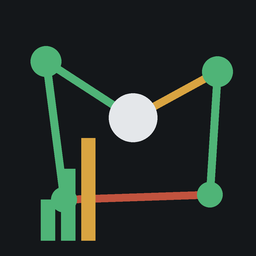

<div align="center">
  

# Zigbee Mesh Health

**Passive LQI and routing-health monitor for Zigbee2MQTT.**

Tracks link quality over time and flags degrading devices before they fail, **without adding extra radio traffic** to your mesh.

[](https://github.com/VoidElle/zigbee-mesh-health/tags)
[](LICENSE)
[](https://github.com/VoidElle/zigbee-mesh-health/actions/workflows/test.yml)
[](https://github.com/VoidElle/zigbee-mesh-health/actions/workflows/build.yml)
[](https://www.home-assistant.io/)
[](https://www.zigbee2mqtt.io/)
[](https://github.com/VoidElle/zigbee-mesh-health/stargazers)
[](https://github.com/VoidElle/zigbee-mesh-health/commits)

</div>

---

A small self-hosted service that subscribes to your Zigbee2MQTT broker, stores every `linkquality` value devices already publish, records bridge events (route failures, leaves, restarts, version changes), and serves a dashboard with per-device LQI trends, alert states, a network map, and an event log. **SQLite storage, zero cloud dependencies.** Ships as a Home Assistant add-on (with sidebar ingress) or a plain Docker image.

## ✨ Features

- **📡 Passive by default**: reuses the `linkquality` that every Zigbee2MQTT device already reports, so there is no extra radio traffic between scans.
- **📉 Trend-based alerting**: flags a device when its 24h average LQI drops more than a configurable % below its 7-day baseline, catching slow degradation before it becomes a dead node.
- **🚨 Absolute + failure alerts**: also flags links that fall below an absolute LQI floor, or that rack up route/delivery failures in 24h.
- **🗺️ Network map**: the last snapshot from `bridge/request/networkmap` (raw links + LQI), with a legend and weakest-link highlighting. Active scans are hard-capped (see below).
- **📋 Event log**: device leaves/joins, route and delivery failures, bridge restarts and Zigbee2MQTT version changes, filterable by type and period.
- **🏷️ Device aliases**: rename devices in the UI without touching Zigbee2MQTT.
- **🌍 Bilingual UI** (Italian / English) with a flag switcher and persisted preference.
- **💾 Bounded storage**: raw LQI samples are rolled up into daily min/max/avg, then deleted after `RETENTION_DAYS` (default 30).
- **🏠 Home Assistant add-on**: installed from this repo, exposed in the HA sidebar via ingress (no exposed ports, no extra credentials).

## 📥 The three data channels

| # | Channel | Frequency | Cost |
|---|---------|-----------|------|
| 1 | **Passive LQI**: subscribes `<base_topic>/+`, extracts `linkquality` from normal device messages | continuous | zero extra radio traffic |
| 2 | **Networkmap**: publishes `bridge/request/networkmap` with payload `"raw"` | 1/day scheduled (default 04:00) + manual trigger rate-limited to 1/hour | heavy |
| 3 | **Bridge events**: subscribes `bridge/event` (device leaves/joins/announces), `bridge/logging` (route/delivery failures, restarts) and `bridge/info` (version/coordinator changes) | continuous | negligible |

**Why the networkmap must be rare:** it runs an *active* LQI scan. The coordinator interrogates every router on the mesh in sequence, generating additional radio traffic, and can take minutes with partial failures on unstable networks. Hammering it degrades the very network you're monitoring. That's why this app hard-caps it: one scheduled scan per day, no retry-on-timeout (the next scheduled run retries), and a server-side rate limit of minimum 1 hour between manual triggers. The manual trigger consumes the rate-limit window even when it fails, so a broken bridge can't be hammered. The snapshot is used only for the map view, never as a source for the continuous trend.

**Getting log-based events:** Zigbee2MQTT publishes its log to `bridge/logging` only when its config includes `mqtt` in the output, e.g. `log: { output: ['console', 'file', 'mqtt'] }`. With the default output the topic stays silent, and only `bridge/event` and `bridge/info` events are recorded. Unmatched debug-level log lines are ignored, so enabling `log_level: debug` alongside mqtt output does not flood the event log.

## 🚀 Installation

### Home Assistant add-on (recommended) ⭐

This repo doubles as an **add-on repository**. Two ways to install:

**A. From the published repository (prebuilt images):**

1. HA UI: *Settings → Add-ons → Add-on Store → ⋮ (top right) → Repositories* → add `https://github.com/VoidElle/zigbee-mesh-health`.
2. Refresh the store → **Zigbee Mesh Health** appears → **Install**. Prebuilt multi-arch images (aarch64/amd64/armv7/i386) are pulled from GHCR, so nothing is compiled on the HA box.
3. Start the Mosquitto broker add-on (or use an external broker; see options), set options on the add-on **Configuration** tab, then **Start**. The **Log** should show `Starting zigbee-mesh-health (broker ...)`.

**B. Local repository (no GHCR needed):**

1. Clone this repo on the HA host (HAOS: via the SSH/Samba add-on, e.g. to `/addons/zigbee-mesh-health`; Container: next to the HA config dir).
2. Remove the `image:` line from `addon/config.yaml`, otherwise the store tries to pull from GHCR.
3. Add the **full local path** to the cloned repo (the directory containing `repository.yaml`) under *Repositories*, refresh, install. The image is built on the HA machine itself, which takes minutes on ARM due to `better-sqlite3`.

The dashboard opens from the HA sidebar as **Zigbee Mesh Health** (ingress, authenticated with your HA login, no extra credentials or exposed ports). All options are documented in [`addon/DOCS.md`](addon/DOCS.md); leave `mqtt_host` empty to auto-discover the Mosquitto broker add-on.

### Docker

```bash
docker compose up -d
```

The compose file mounts `./data` for persistent SQLite storage and exposes port 8080. Set `MQTT_HOST` to your broker's address as seen from the container (e.g. `host.docker.internal` if the broker runs on the Docker host, or your broker's LAN IP / container name).

### Run locally

```bash
npm ci
npm run build
npm start   # or: node dist/index.js
```

Point `MQTT_HOST`/`MQTT_PORT` at your broker (Zigbee2MQTT must be publishing to it), then open <http://localhost:8080>.

## 🖥️ Dashboard

- **Overview**: mesh-average LQI trend (24h), device/status counters, "devices to check" (warning/critical), silent devices (no message in 24h), a compact network-map summary and recent events.
- **Devices**: sidebar list with current LQI, alert state and 24h/7d averages; click a device for an LQI chart (24h/7d/30d), its events, and an inline alias rename.
- **Network map**: last `networkmap` snapshot as a graph, colour-coded by LQI (≥120 / 60–119 / <60), with the *Refresh map* button (max 1/hour).
- **Events**: filterable event log (route failure, delivery failure, device leave, bridge restart, version change, state change, other) over 24h / 7d / 30d / all.

## ⚙️ Configuration

All via environment variables when running standalone:

| Variable | Default | Meaning |
|----------|---------|---------|
| `MQTT_HOST` | `localhost` | MQTT broker host |
| `MQTT_PORT` | `1883` | MQTT broker port |
| `MQTT_USERNAME` / `MQTT_PASSWORD` | *(empty = disabled)* | Broker credentials, if required |
| `Z2M_BASE_TOPIC` | `zigbee2mqtt` | Zigbee2MQTT base topic |
| `HTTP_PORT` | `8080` | Express API/UI port |
| `DATA_DIR` | `./data` | Directory for the SQLite file |
| `NETWORKMAP_SCHEDULE` | `04:00` | Daily networkmap time, `HH:MM` (pick a low-traffic hour) |
| `NETWORKMAP_TIMEOUT_MS` | `180000` | Wait before giving up on a networkmap response (no retry; next schedule retries) |
| `LQI_WARNING_THRESHOLD_PCT` | `20` | **Warning** when the 24h average LQI drops more than this % below the 7-day average (device is degrading) |
| `LQI_CRITICAL_ABSOLUTE` | `50` | **Critical** when the 24h average LQI falls below this absolute value (link nearly dead) |
| `ROUTE_FAILURE_CRITICAL_COUNT` | `5` | **Critical** when a device has this many route/delivery failures in the last 24h |
| `RETENTION_DAYS` | `30` | Raw LQI samples older than this are aggregated into daily min/max/avg per device, then deleted |
| `API_KEY` | *(empty = disabled)* | When set, `/api/*` requires `Authorization: Bearer <key>` or `x-api-key` header |
| `FLUSH_INTERVAL_MS` | `10000` | LQI samples are buffered in memory and flushed to SQLite every this many ms |
| `FLUSH_BATCH_SIZE` | `100` | …or when this many samples are buffered, whichever comes first |

For the Home Assistant add-on, the same settings are exposed as snake_case options in the add-on **Configuration** tab (`mqtt_host`, `base_topic`, `networkmap_schedule`, `lqi_warning_threshold_pct`, …). See [`addon/DOCS.md`](addon/DOCS.md) for the full list.

## 🔌 API

| Route | Description |
|-------|-------------|
| `GET /api/devices` | Known devices with current LQI, 24h/7d averages, failures and alert state (`ok` / `warning` / `critical`) |
| `PUT /api/devices/{name}/alias` | Set or clear (`""`) a device alias (max 60 chars) |
| `GET /api/devices/{name}/history?range=24h\|7d\|30d` | LQI time series for one device |
| `GET /api/mesh/history?range=24h\|7d\|30d` | Mesh-wide average LQI over time (~96 buckets) |
| `GET /api/events?type=&since=&limit=` | Event log, filterable by type and time window (`24h`/`7d`/`30d` or ISO date) |
| `GET /api/events/stream` | Server-Sent Events; pushes a kick whenever an event is stored (frontend re-fetches) |
| `GET /api/samples/stream` | Server-Sent Events; pushes a kick per LQI sample flush (frontend re-polls) |
| `GET /api/network/latest` | Last networkmap snapshot (404 until the first scan completes) |
| `POST /api/network/refresh` | Manual networkmap trigger, rate-limited to 1/hour (429 if too soon, 409 if one is in flight) |
| `GET /api/health` | Service status: MQTT connection, last sample, last snapshot |

The web UI is served from the same process at `/`. When `API_KEY` is set, every `/api/*` call needs the key; ingress access from Home Assistant is authenticated by HA and never needs it.

## 🎚️ Tuning the alert thresholds

- **Warning (trend-based):** fires when `avg(24h) < avg(7d) × (1 − LQI_WARNING_THRESHOLD_PCT/100)`. Catches slow degradation in a device whose link is getting worse day by day. Lower the % for earlier warning, raise it to reduce noise.
- **Critical (absolute):** fires when `avg(24h) < LQI_CRITICAL_ABSOLUTE`. The link is nearly unusable now. LQI is 0–255; 50 is a weak link, 100+ is healthy.
- **Critical (failures):** fires when a device logs `ROUTE_FAILURE_CRITICAL_COUNT` route/delivery failures in 24h. The mesh is actively struggling to reach it, even if LQI still looks acceptable.

Check the events view to correlate a degradation with a `bridge_restart` or `version_change` (firmware/Z2M update) before swapping hardware.

## 💾 Data & retention

Everything lives in a single SQLite file (`DATA_DIR/mesh-health.db`, or the add-on's `/data`, which Home Assistant includes in backups automatically). Raw LQI samples older than `RETENTION_DAYS` are aggregated into daily min/max/avg per device and then deleted, so the database stays bounded. Events and network snapshots are kept indefinitely (they're tiny).

## 🛠️ Development

```bash
npm ci
npx prisma generate   # Prisma client is generated into src/generated (gitignored)
npm run build         # tsc
npm test
```

Design tokens/theme/base live in `src/styles/tailwind.css`; utility classes go in `public/index.html` and `public/app.js`. After editing either, regenerate the served stylesheet:

```bash
npm run css        # or: npm run css:watch
```

`public/styles.css` is generated and committed, so include the regenerated file in your commit. Same after any markup/class change: run `npm run css` and commit `public/styles.css`.

UI strings live in `public/i18n/{it,en}.json` as flat `"a.b"` keys; `public/i18n.js` is the runtime (`t()`, `data-i18n*` attributes, `localStorage.lang`). The flag switcher sits top-right, persists the choice, and defaults from the browser language. To add a language: drop `public/i18n/<code>.json` and add `<code>` to the `LANGS` array in `public/i18n.js` (`LOCALES` maps it to a BCP-47 tag used for dates). Keep `it.json`/`en.json` keys in sync, since `test/i18n.test.mjs` enforces parity.

### Tests

The suite uses Node's built-in test runner (`node:test`) against the compiled `dist/` output, with no extra dependencies:

```bash
npm test   # runs `npm run build`, then `node --test test/*.test.mjs`
```

Unit tests live in `test/*.test.mjs`; the golden HTTP-API fixtures and the golden-capture tool live in `test/fixtures/`. CI also runs `node --check` on the frontend scripts.

### Releasing

A release is a git tag. Pushing a tag (e.g. `1.0.12`) triggers the [build workflow](.github/workflows/build.yml), which builds all four arches and publishes them tagged with the `version:` from `addon/config.yaml` (plus `latest`). Before tagging, bump `version` in `addon/config.yaml` **and** `version` in `package.json`, keeping the two and the tag in sync. GHCR packages must be set to **public** once (GitHub → Packages → the image → Package settings) or installs will fail with pull errors.

## 🔍 Troubleshooting

- **No devices in the sidebar**: check `/api/health` (`mqttConnected`, `lastSampleAt`). Zigbee2MQTT must be publishing to the same broker and `base_topic`.
- **No route/delivery failures in the event log**: Zigbee2MQTT's log isn't published over MQTT. Add `'mqtt'` to `log.output` (see [the data channels](#-the-three-data-channels)).
- **Map is empty**: no snapshot yet. Wait for the scheduled scan, or trigger one from the map view (max once per hour).
- **`429 rate_limited` / `409 in_flight`**: expected; the network scan is deliberately throttled.
- **Auth errors after exposing port 8080**: set `API_KEY` and pass `Authorization: Bearer <key>` or `x-api-key`.

## 🤝 Contributing

Contributions are welcome. Bug reports and PRs via [GitHub Issues](https://github.com/VoidElle/zigbee-mesh-health/issues) / [Pull Requests](https://github.com/VoidElle/zigbee-mesh-health/pulls). Run `npm test` and `npm run css` before opening a PR.

## 📄 License

[MIT](LICENSE)
